# 🛡️ FastAPI RBAC - Frontend Streamlit

Interface administrativa completa para o sistema de controle de acesso baseado em papéis (RBAC) desenvolvida com Streamlit.

## 🎯 Funcionalidades

### 🔐 Sistema de Autenticação
- **Login básico** com usuário e senha
- **Registro de novos usuários**
- **Validação de sessão** com timeout automático
- **Logout seguro** com limpeza de sessão
- **Visualização de provedores OAuth** disponíveis

### 📊 Dashboard Administrativo
- **Métricas principais** do sistema
- **Gráficos interativos** com Plotly
- **Visão geral de usuários** por provedor
- **Distribuição de papéis** e permissões
- **Atividade recente** do sistema
- **Status em tempo real** da API

### 👥 Gerenciamento de Usuários
- **Lista completa** de usuários com busca e filtros
- **Criação de novos usuários** com atribuição de papéis
- **Edição de perfis** e gerenciamento de papéis
- **Atribuição/remoção de papéis** em tempo real
- **Estatísticas detalhadas** por provedor e papel
- **Exportação para CSV**

### 🏛️ Gerenciamento de Tenants (Admin)
- **Visualização completa** de todos os tenants do sistema.
- **Ações de moderação**: Ativar, suspender e verificar tenants.
- **Visualização de usuários** e estatísticas por tenant.

### 🔑 Gerenciamento de API Keys (por Tenant)
- **CRUD completo** para chaves de API dentro do tenant do usuário.
- **Geração e rotação** de chaves seguras.
- **Monitoramento de uso** e datas de expiração.

### 🔗 Gerenciamento de Webhooks (por Tenant)
- **CRUD completo** para webhooks.
- **Visualização de logs de entrega** e status.
- **Interface para enviar eventos de teste**.

### 🎭 Gerenciamento de Papéis
- **CRUD completo** de papéis
- **Gestão de permissões** por papel
- **Hierarquia visual** de papéis
- **Atribuição/remoção** de permissões
- **Análise de distribuição** de usuários
- **Proteção de papéis** do sistema

### 🔐 Gerenciamento de Permissões
- **Visualização organizada** por recurso
- **Criação de novas permissões** com assistente
- **Análise de uso** das permissões
- **Padrões CRUD** por recurso
- **Identificação de permissões** não utilizadas
- **Matriz de permissões** interativa

### 🧪 Páginas de Exemplo
- **Posts** - Demonstração de CRUD com permissões
- **Configurações** - Acesso a configurações sensíveis
- **Testes de API** - Interface para testar endpoints
- **Matriz de permissões** do usuário atual

## 🚀 Como Executar

### 1. Preparação do Ambiente

Certifique-se de que o backend FastAPI está rodando:

```bash
# Em um terminal, execute o backend
uv run task dev
```

### 2. Executar o Frontend

Em outro terminal:

```bash
# Executar o frontend Streamlit
uv run task front
```

O frontend estará disponível em: **http://localhost:8501**

### 3. Credenciais de Acesso

Use as credenciais do administrador:

- **Usuário:** `admin`
- **Senha:** `admin123`

## 🏗️ Arquitetura do Frontend

### Estrutura de Diretórios

```
front/
├── streamlit_app.py          # Aplicação principal
├── config/
│   └── settings.py           # Configurações
├── services/
│   ├── api_client.py         # Cliente HTTP para API
│   └── auth_service.py       # Serviços de autenticação
├── pages/
│   ├── login.py             # Página de login
│   ├── dashboard.py         # Dashboard principal
│   ├── users.py             # Gerenciar usuários
│   ├── roles.py             # Gerenciar papéis
│   ├── permissions.py       # Gerenciar permissões
│   ├── tenants.py           # Gerenciar tenants (Admin)
│   ├── api_keys.py          # Gerenciar chaves de API
│   ├── webhooks.py          # Gerenciar webhooks
│   └── examples.py          # Páginas de exemplo
├── components/
│   ├── auth.py              # Componentes de autenticação
│   └── sidebar.py           # Sidebar com navegação
└── utils/
    └── helpers.py           # Funções auxiliares
```

### Separação de Responsabilidades

1. **`streamlit_app.py`** - Aplicação principal e roteamento
2. **`config/`** - Configurações globais do frontend
3. **`services/`** - Comunicação com API e lógica de negócio
4. **`pages/`** - Páginas específicas da aplicação
5. **`components/`** - Componentes reutilizáveis de UI
6. **`utils/`** - Funções auxiliares e utilitários

### Fluxo de Autenticação

```mermaid
graph TD
    A[Usuário acessa] --> B{Autenticado?}
    B -->|Não| C[Página de Login]
    B -->|Sim| D{Sessão válida?}
    D -->|Não| E[Limpar sessão] --> C
    D -->|Sim| F[Dashboard Principal]
    C --> G[Credenciais] --> H[API Login]
    H -->|Sucesso| I[Armazenar token] --> F
    H -->|Erro| J[Mostrar erro] --> C
```



### Sistema de Permissões

O frontend implementa controle de acesso baseado em permissões:

```python
# Verificação de permissão simples
if auth_service.has_permission("users:read"):
    show_users_list()

# Verificação com UI automática
@check_permission_ui("users:create")
def create_user_form():
    # Form só é mostrado se usuário tem permissão
    pass
```

## 🎨 Interface e UX

### Design System

- **Paleta de cores** consistente para papéis e status
- **Ícones intuitivos** para cada funcionalidade
- **Layout responsivo** que funciona em diferentes telas
- **Feedback visual** para todas as ações
- **Estados de loading** e tratamento de erros

### Componentes Principais

1. **Sidebar de Navegação** - Menu principal com controle de acesso
2. **Cards de Métricas** - Indicadores visuais importantes
3. **Tabelas Interativas** - Com busca, filtros e paginação
4. **Formulários Dinâmicos** - Validação em tempo real
5. **Gráficos Plotly** - Visualizações interativas

### Estados da Aplicação

- **Loading** - Indicadores durante carregamento
- **Sucesso** - Confirmações de ações realizadas
- **Erro** - Mensagens claras de problemas
- **Vazio** - Estados quando não há dados
- **Isolamento de Dados**: A interface garante que usuários normais vejam apenas dados (API Keys, Webhooks, etc.) do seu próprio tenant.
- **Sem permissão** - Feedback claro de acesso negado

## 🔧 Configurações

### Variáveis de Ambiente

```bash
# URL da API backend
API_BASE_URL=http://127.0.0.1:8000

# Debug mode
DEBUG=false
```

### Configurações do Streamlit

As configurações estão em `front/config/settings.py`:

```python
class FrontendSettings:
    API_BASE_URL: str = "http://127.0.0.1:8000"
    PAGE_TITLE: str = "RBAC Admin"
    PAGE_ICON: str = "🛡️"
    LAYOUT: str = "wide"
    SESSION_TIMEOUT: int = 30  # minutes
```

## 📱 Funcionalidades por Página

### 🏠 Dashboard
- Métricas de usuários, papéis e permissões
- Gráfico de usuários por provedor (pie chart)
- Distribuição de papéis (bar chart)
- Análise de permissões por recurso/ação
- Atividade recente simulada
- Status do sistema em tempo real

### 👥 Usuários
- **Lista:** Busca, filtros por provedor/status, paginação
- **Criação:** Formulário completo com atribuição de papéis
- **Edição:** Edição inline com gerenciamento de papéis
- **Estatísticas:** Análise por provedor, papel e registros recentes
- **Exportação:** Download de CSV com todos os dados

### 🏛️ Tenants (Admin)
- **Visualização e Gestão**: Interface para administrar todos os tenants.
- **Ações Rápidas**: Botões para verificar, suspender e reativar tenants.

### 🔑 API Keys e 🔗 Webhooks
- **Interface por Tenant**: Cada usuário gerencia seus próprios recursos.
- **Visualização Clara**: Listas com status, datas e ações rápidas.
- **Formulários Intuitivos**: Para criação e edição.

### 🎭 Papéis
- **Lista:** Visualização com permissões associadas
- **Criação:** Assistente com seleção de permissões por recurso
- **Edição:** Gestão dinâmica de permissões
- **Análise:** Hierarquia por quantidade de permissões
- **Proteção:** Papéis do sistema não podem ser deletados

### 🔐 Permissões
- **Organização:** Agrupamento por recurso
- **Criação:** Assistente com padrões CRUD
- **Análise:** Permissões mais/menos utilizadas
- **CRUD Patterns:** Análise de completude por recurso
- **Usage Tracking:** Identificação de permissões órfãs

### 📝 Posts (Exemplo)
- Demonstração de controle de acesso granular
- Interface CRUD completa com permissões
- Teste de endpoints protegidos
- Matriz de permissões do usuário

### ⚙️ Configurações (Exemplo)
- Acesso restrito por permissões
- Diferentes níveis de configuração
- Demonstração de UI condicionais

## 🧪 Testes e Demonstração

### Cenários de Teste

1. **Login com diferentes usuários**
   - Admin: Acesso completo
   - Manager: Acesso limitado
   - Editor: Apenas posts
   - Viewer: Apenas leitura

2. **Gestão de usuários**
   - Criar novos usuários
   - Atribuir diferentes papéis
   - Testar permissões resultantes

3. **Criação de papéis customizados**
   - Criar papel "Moderador"
   - Atribuir permissões específicas
   - Testar funcionalidades resultantes

4. **Teste de endpoints**
   - Usar a página de testes de API
   - Verificar matriz de permissões
   - Testar diferentes cenários

### Dados de Demonstração

O sistema vem com dados pré-configurados:

- **4 papéis:** admin, manager, editor, viewer
- **18 permissões:** CRUD completo para todos os recursos
- **1 usuário admin:** Acesso completo ao sistema

## 🚀 Próximos Passos

### Funcionalidades Futuras

1. **Autenticação OAuth completa** - Implementar fluxo completo
2. **Auditoria e logs** - Página de logs de atividades
3. **Configurações avançadas do Tenant** - Interface para configurações específicas do tenant
4. **Relatórios** - Dashboards com mais métricas
5. **Importação/Exportação** - Backup e restore de configurações
6. **Temas** - Modo escuro e personalizações
7. **Notificações** - Sistema de alertas em tempo real

### Melhorias de Performance

1. **Cache de dados** - Otimizar carregamento
2. **Paginação server-side** - Para grandes volumes
3. **Busca otimizada** - Busca no backend
4. **Lazy loading** - Carregamento sob demanda

## 📋 Comandos Úteis

```bash
# Executar frontend
uv run task front

# Executar backend (necessário)
uv run task dev

# Executar ambos em terminais separados
# Terminal 1:
uv run task dev

# Terminal 2:
uv run task front
```

## 🎯 Resumo

Este frontend Streamlit oferece uma interface administrativa completa e profissional para o sistema FastAPI RBAC, com:

- ✅ **Interface intuitiva** e responsiva
- ✅ **Controle de acesso** granular em todas as páginas
- ✅ **CRUD completo** para usuários, papéis e permissões
- ✅ **Dashboard interativo** com métricas em tempo real
- ✅ **Arquitetura limpa** com separação de responsabilidades
- ✅ **Documentação completa** e exemplos de uso
- ✅ **Tratamento de erros** robusto
- ✅ **Feedback visual** consistente

A aplicação está pronta para uso em produção após configuração adequada das variáveis de ambiente e segurança. 